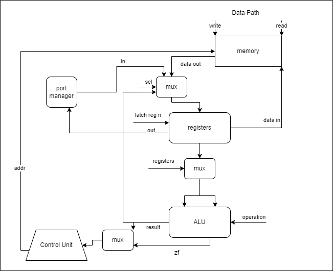

# Risc Machine. Экспериментальная модель процессора и транслятора

- Терновский Илья Евгеньевич, P3232
- alg -> asm | risc | neum | hw | tick -> instr | struct | stream | port | | prob1 | pipeline
- Упрощенный вариант (asm | risc | neum | hw | instr | struct | stream | port | pstr | prob1)

## Язык программирования

Синтаксис в расширенной БНФ.

```ebnf
<program> ::=  <section_data> <section_code> 

<section_data> ::= "." "data" { \n <data_definition> {<comment>} }
<section_code> ::= "." "code" { \n <instruction> {<comment>} }

<instruction> ::= "jmp" <label>
               | "jz" <label>
               | "jnz" <label>
               | "halt"
               | "move" <register> <operand>
               | "cmp" <register> <register>
               | "add" <register> <register> <register>
               | "sub" <register> <register> <register>
               | "mod" <register> <register> <register>
               | "load" <register> <address>
               | "store" <register> <address>
               | "in" <register>
               | "out" <register>
               | "inc" <register>
               | <label> ":"

<data_definition> ::= <identifier> <data_value>

<data_value> ::= <string>

<address> ::= $<identifier>

<register> ::= "r"<number>

<operand> ::= <register>
            | "#"<number>

<label> ::= <identifier>

<identifier> ::= <letter> { <letter> | <digit> }
         
<number> ::= <digit> { <digit> }

<string> ::= "\"" { <character> } "\""

<letter> ::= "a" | "b" | "c" | ... | "z"
           | "A" | "B" | "C" | ... | "Z"

<digit> ::= "0" | "1" | "2" | "3" | "4" | "5" | "6" | "7" | "8" | "9"

<character> ::= <any printable ASCII character except quotation mark>

<comment> ::= ";" { <any printable ASCII character> }
```

В программе не может быть меток с одним названием, метки могут быть определены после использования.
Типизации не существует, все переменные трактуются как числа.

Код выполняется последовательно.

Команды:

- `load a, b` - загрузка из памяти значения по адресу `b` в регистр `a`, для указания значения из data используется `$`.
- `store a, b` - сохранение в память содержимого регистра `a` по адресу `b`.
- `add a, b, c` - сложение содержимого регистров `b`, `с`, и запись результата в регистр `a`.
- `sub a, b, c` - вычитание из регистра `b` регистра `с`, и запись результата в регистр `a`.
- `mod a, b, c` - остаток от деления регистра `b` на регистр `c`, и запись результата в регистр `a`.
- `inc a` - увеличение регистра `a` на 1.
- `cmp a, b` - выставление флагов по результату операции `a - b`.
- `halt` - остановка процессора.
- `in a` - запись значения в регистр `r8` из порта `a`.
- `out a` - вывод значения из памяти по регистру `r8` в порт `a` .
- `outn a` - вывод значения из регистра `a` (число которое лежит в регистре).
- `jz a` - переход на адрес `a`, если флаг `z` положительный.
- `jnz a` - переход на адрес `a`, если флаг `z` отрицательный.
- `jmp a` - переход на адрес `a`.
- `move a, b` - загрузка значения из регистра/прямое `b` в регистр `a`.

## Организация памяти

- Размер машинного слова не определен. Реализуется массивом словарей, одна команда\символ одна ячейка.

- Адресация абсолютная, адреса программы начинаются с 0,
  данные идут непосредственно со следующей ячейки после последней команды программы.

- Программисту доступно 9 регистров, адресуемых от r0 до r8, регистр r8 используется для IO.
  Так же 200 ячеек под программу и данные (каждый символ данных занимает одну ячейку).

- Регистры связаны напрямую с памятью.

```text
           registers
+----------------------------+
| r0                         |
+----------------------------+
| r1                         |
+----------------------------+
| r2                         |
+----------------------------+
| r3                         |
+----------------------------+
| r4                         |
+----------------------------+
| r5                         |
+----------------------------+
| r6                         |
+----------------------------+
| r7                         |
+----------------------------+
| r8                         |
+----------------------------+


           memory
+----------------------------+
| 0 : op 0                   |
| 1 : op 1                   |
| ...                        |
| i : op i                   |
| i+1 const 1                |
| ...                        |
| i+k var 1                  |
| i+k+1 var 2                |
| ...                        |
+----------------------------+
```

- В ячейках 0-i хранятся команды программы.
- В ячейках i+1-i+k хранятся константы.
- В ячейках i+k+1-i+k+m хранятся переменные.
- Константы записываются в том же порядке, что и в секции data.
- Программист в праве записывать переменные вместо констант, на свой страх и риск.
- Текстовые данные занимают одну ячейку памяти на символ + ячейка для хранения длины.
- Числа записываются в ячейки памяти как есть.

По особенностям, так как программист напрямую управляет регистрами и памятью, стоит отметить только то,
что статические данные из секции data инициализируются при загрузке программы и отображаются в память,
путем записи каждого символа в новую ячейку памяти, при этом одна ячейка до первого символа занимается длинной строки.

Прямая работа с памятью невозможна, так как все данные хранятся в регистрах, и доступ к ним осуществляется через них.

### Ввод вывод

- Реализован port mapped IO
- Ввод и вывод осуществляется через порт 0.
- Для ввода используется команда `in a`, для вывода `out a`, где `a` - порт из|в который
  будет загружено значение из регистра r8(IO reg).

## Система команд

### Особенности процессора

- Поддерживаются только целочисленные операции.
- Поддерживаются строки, но только в качестве данных, которые затем будут представлены в виде чисел в памяти.
- Поддерживается 8 регистров (для решения поставленных задач не потребовалось больше), доступных для программы.
- Поддерживается 200 ячеек памяти для программы и данных.
- Поддерживаются команды ввода и вывода.
- Поток управления
    - Последовательное выполнение команд путем увеличения PC на 1 после каждой команды.
    - Условные переходы (jz, jnz), безусловные переходы (jmp), поддерживаются метки.
    - Остановка процессора (halt).

### Набор инструкций

- Команды однозначно транслируются в машинный код.
- Декодирование инструкции происходит за 1 такт.

Инструкции

| Инструкция | Кол-во тактов |
|:-----------|---------------|
| halt       | 0             |
| load       | 2             |
| store      | 2             |
| add        | 2             |
| sub        | 2             |
| mod        | 2             |
| inc        | 2             |
| cmp        | 2             |
| jz         | 1             |
| jnz        | 1             |
| jmp        | 1             |
| move       | 2             |
| in         | 2             |
| out        | 2             |

### Кодирование инструкций

- Машинный код сериализуется в список JSON.
- Один элемент списка - одна инструкция.
  Пример:

```json
[
  {
    "index": 0,
    "opcode": "load",
    "args": [
      41,
      0,
      "data"
    ],
    "term": [
      1,
      null,
      "load"
    ]
  }
]
```

Где:

- `opcode` - строка с кодом операции;
- `args` - список аргументов команды, в данном случае: 41 - значение, 0 - регистр,
  "data" - обозначение о прямой записи значения;
- `index` - индекс команды в программе;
- `term` - список для упрощения отладки, в данном случае: 1 - строка с командой в секции code, null - метка в читаемом
  виде,
  "load" - строка с командой.

## Транслятор

Интерфейс командной строки: `translator.py <input_file>.zxc <target_file>`
Реализовано в модуле: [translator.py](./translator.py)

Программа принимает на вход файл с исходным кодом, при этом расширение должно быть обязательно .zxc,
так же принимает файл для записи машинного кода.

Он выполняет данные шаги:

1. Удаляет комментарии и пустые строки, для упрощения дальнейшей работы (функция `clean_source`).
2. Отделяет секцию data от code, что бы при обработке кода было проще подсчитывать номера команд.
   (функция `remove_data`).
3. Обрабатывает метки путем записи в словарь, что бы при обработке кода можно было использовать их.
   (функция `parse_labels`).
4. Обрабатывает секцию данных путем добавления данных в специальный список,
   который затем будет посимвольно отображен в память. (функция `parse_data`).
5. Транслирует исходный код в машинный код, при этом используя словарь меток и список данных. (функция `translate`).
6. Записывает машинный код в файл. (функция `write_code` из модуля `isa`).

### Правила трансляции

- Обязательное наличие секции data и code (могут быть пустыми).
- В секции data могут быть только строки вида `hello "hello world" 11` (pstr).
- Имена меток не должны повторяться.
- В секции code метки могут быть определены после использования.
- В секции code могут быть только команды из списка инструкций.
- При наличии данных в секции data, они будут записаны в память сразу после программы в порядке их следования.

## Модель процессора

Интерфейс командной строки:`machine.py <machine_code_file> <input_file>`
Реализовано в модуле: [machine.py](./machine.py)

### DataPath


Реализован в классе `DataPath`.

Сигналы (реализованы в виде методов в классе):

Для регистров реализован отдельный класс `Registers`, для упрощения работы.
С данными сигналами:

- `latch_register` - защелкнуть значение в регистр.
- `get_register` - получить значение из регистра.
- Сами регистры представляют собой список из 8 элементов, каждый из которых является числом.

Для АЛУ реализован отдельный класс `ALU`, для упрощения работы.
С данными сигналами:

- `add`, `sub`, `mod`, `inc`, `dec` - выполнить операцию сложения, вычитания, остатка от деления,
  инкремента и декремента.
- Так же присутствует флаг `zero_flag`, который устанавливается в True, если результат операции равен 0.

Для Менеджера портов реализован отдельный класс `PortManager`, для упрощения работы.
С данными сигналами:

- `signal_input` - прочитать значение из порта, при этом происходит конвертирование символа в число.
- `signal_output` - записать значение в порт, при этом происходит конвертирование числа в символ, либо прямой вывод
  числа.

И главный класс `DataPath` реализует сигналы:

- `read` - прочитать значение из памяти.
- `write` - записать значение в память.
- Так же реализует память в виде списка, где каждый элемент является объектом команды.

### ControlUnit


Реализован в классе `ControlUnit`.

- Hardwired.
- Выполнение и декодирование инструкций происходит в методе `decode_and_execute_instruction`.
- В зависимости от инструкции, вызываются методы класса `DataPath` для выполнения операций.
- Выполнение команд происходит в методах execute_`command_name`.
- `latch_pc` - защелкнуть значение PC.
- `tick` - используется для отслеживания тактов.
- Обработка команд не останавливается, пока не встретится команда `halt`.

Особенности работы модели:

- Перед началом симуляции процессора, происходит обработка данных и посимвольное добавление их в конец программы.
- Цикл симуляции осуществляется в функции `simulation`.
- Шаг моделирования соответствует одной инструкции, с выводом состояния в журнал.
- Для журнала состояний процессора используется стандартный модуль `logging`.
- Количество инструкций для моделирования лимитировано (по умолчанию 20000 для нормальной работы prob1).
- Остановка моделирования осуществляется:
    - При превышении лимита количества выполняемых инструкций (по умолчанию 20000).
    - При появлении исключения `StopIteration` -- если выполнена инструкция `halt`.
    - При ошибке обработки инструкции (если в программе нет halt, и она начинает читать данные).

## Тестирование

- Тестирование осуществляется при помощи golden test-ов.
- Настройка golden тестирования находится в [файле](./golden_asm_test.py)
- Конфигурация golden test-ов находится в [директории](./golden)
    - [cat](./golden/cat.yml) - программа, которая копирует ввод в вывод.
    - [hello_world](./golden/hello_world.yml) - базовый hello world.
    - [prob1](./golden/prob1.yml) - вывести сумму чисел, меньших 1000 и делящихся на 3 или на 5.
    - [hello_username](./golden/hello_username.yml) - запросить у пользователя его имя, считать его, вывести на экран
      приветствие.
- Запустить тесты: `poetry run pytest . -v`
- Обновить конфигурацию golden tests: `poetry run pytest . -v --update-goldens`

CI при помощи Github Actions(тактически сворован с примера):

```yaml
name: Python CI

on:
  push:
    branches:
      - main

defaults:
  run:
    working-directory: ./

jobs:
  test:
    runs-on: ubuntu-latest

    steps:
      - name: Checkout code
        uses: actions/checkout@v4

      - name: Set up Python
        uses: actions/setup-python@v4
        with:
          python-version: 3.11

      - name: Install dependencies
        run: |
          python -m pip install --upgrade pip
          pip install poetry
          poetry install

      - name: Run tests and collect coverage
        run: |
          poetry run coverage run -m pytest .
          poetry run coverage report -m
        env:
          CI: true

  lint:
    runs-on: ubuntu-latest

    steps:
      - name: Checkout code
        uses: actions/checkout@v4

      - name: Set up Python
        uses: actions/setup-python@v4
        with:
          python-version: 3.11

      - name: Install dependencies
        run: |
          python -m pip install --upgrade pip
          pip install poetry
          poetry install

      - name: Check code formatting with Ruff
        run: poetry run ruff format --check .

      - name: Run Ruff linters
        run: poetry run ruff check .
```

где:

- `poetry` -- управления зависимостями для языка программирования Python.
- `coverage` -- формирование отчёта об уровне покрытия исходного кода.
- `pytest` -- утилита для запуска тестов.
- `ruff` -- утилита для форматирования и проверки стиля кодирования.

Пример использования и журнал работы процессора на примере программы `cat`:

``` shell
cat .\examples\input.txt
ilushaвє

cat .\examples\cat.zxc
.data

.code
    move r0 #0 ; next symbol
    move r1 #9786 ; end char
    loop:
        in 0
        cmp r8 r1
        jz end
        out 0
        jmp loop
    end:
        halt
./translator.py .\examples\cat.zxc output.cxz
source LoC: 13 code instr: 8
cat output.cxz
[
    {
        "index": 0,
        "opcode": "move",
        "args": [
            0,
            0,
            "direct"
        ],
        "term": [
            0,
            null,
            "move"
        ]
    },
    {
        "index": 1,
        "opcode": "move",
        "args": [
            1,
            9786,
            "direct"
        ],
        "term": [
            1,
            null,
            "move"
        ]
    },
    {
        "index": 2,
        "opcode": "in",
        "args": [
            "0"
        ],
        "term": [
            3,
            null,
            "in"
        ]
    },
    {
        "index": 3,
        "opcode": "cmp",
        "args": [
            8,
            1
        ],
        "term": [
            4,
            null,
            "cmp"
        ]
    },
    {
        "index": 4,
        "opcode": "jz",
        "args": [
            "absolute",
            7
        ],
        "term": [
            5,
            "end",
            "jz"
        ]
    },
    {
        "index": 5,
        "opcode": "out",
        "args": [
            "0"
        ],
        "term": [
            6,
            null,
            "out"
        ]
    },
    {
        "index": 6,
        "opcode": "jmp",
        "args": [
            "absolute",
            2
        ],
        "term": [
            7,
            "loop",
            "jmp"
        ]
    },
    {
        "index": 7,
        "opcode": "halt",
        "args": [],
        "term": [
            9,
            null,
            "halt"
        ]
    }
]
python .\machine.py .\output.cxz .\examples\input.txt
DEBUG:root:Tick:   2 PC:   1 R0:   0 R1:   0 R2:   0 R3:   0 R4:   0 R5:   0 R6:   0 R7:   0 R8:   0 Zero: False move [0, 0, 'direct']
DEBUG:root:Tick:   4 PC:   2 R0:   0 R1: 9786 R2:   0 R3:   0 R4:   0 R5:   0 R6:   0 R7:   0 R8:   0 Zero: False move [1, 9786, 'direct']
DEBUG:root:input: 'i', from port 0
DEBUG:root:Tick:   6 PC:   3 R0:   0 R1: 9786 R2:   0 R3:   0 R4:   0 R5:   0 R6:   0 R7:   0 R8: 105 Zero: False in ['0']
DEBUG:root:Tick:   9 PC:   4 R0:   0 R1: 9786 R2:   0 R3:   0 R4:   0 R5:   0 R6:   0 R7:   0 R8: 105 Zero: False cmp [8, 1]
DEBUG:root:Tick:  11 PC:   5 R0:   0 R1: 9786 R2:   0 R3:   0 R4:   0 R5:   0 R6:   0 R7:   0 R8: 105 Zero: False jz ['absolute', 7]
DEBUG:root:output: '' << 'i', to port 0
DEBUG:root:Tick:  13 PC:   6 R0:   0 R1: 9786 R2:   0 R3:   0 R4:   0 R5:   0 R6:   0 R7:   0 R8: 105 Zero: False out ['0']
DEBUG:root:Tick:  15 PC:   2 R0:   0 R1: 9786 R2:   0 R3:   0 R4:   0 R5:   0 R6:   0 R7:   0 R8: 105 Zero: False jmp ['absolute', 2]
DEBUG:root:input: 'l', from port 0
DEBUG:root:Tick:  17 PC:   3 R0:   0 R1: 9786 R2:   0 R3:   0 R4:   0 R5:   0 R6:   0 R7:   0 R8: 108 Zero: False in ['0']
DEBUG:root:Tick:  20 PC:   4 R0:   0 R1: 9786 R2:   0 R3:   0 R4:   0 R5:   0 R6:   0 R7:   0 R8: 108 Zero: False cmp [8, 1]
DEBUG:root:Tick:  22 PC:   5 R0:   0 R1: 9786 R2:   0 R3:   0 R4:   0 R5:   0 R6:   0 R7:   0 R8: 108 Zero: False jz ['absolute', 7]
DEBUG:root:output: 'i' << 'l', to port 0
DEBUG:root:Tick:  24 PC:   6 R0:   0 R1: 9786 R2:   0 R3:   0 R4:   0 R5:   0 R6:   0 R7:   0 R8: 108 Zero: False out ['0']
DEBUG:root:Tick:  26 PC:   2 R0:   0 R1: 9786 R2:   0 R3:   0 R4:   0 R5:   0 R6:   0 R7:   0 R8: 108 Zero: False jmp ['absolute', 2]
DEBUG:root:input: 'u', from port 0
DEBUG:root:Tick:  28 PC:   3 R0:   0 R1: 9786 R2:   0 R3:   0 R4:   0 R5:   0 R6:   0 R7:   0 R8: 117 Zero: False in ['0']
DEBUG:root:Tick:  31 PC:   4 R0:   0 R1: 9786 R2:   0 R3:   0 R4:   0 R5:   0 R6:   0 R7:   0 R8: 117 Zero: False cmp [8, 1]
DEBUG:root:Tick:  33 PC:   5 R0:   0 R1: 9786 R2:   0 R3:   0 R4:   0 R5:   0 R6:   0 R7:   0 R8: 117 Zero: False jz ['absolute', 7]
DEBUG:root:output: 'il' << 'u', to port 0
DEBUG:root:Tick:  35 PC:   6 R0:   0 R1: 9786 R2:   0 R3:   0 R4:   0 R5:   0 R6:   0 R7:   0 R8: 117 Zero: False out ['0']
DEBUG:root:Tick:  37 PC:   2 R0:   0 R1: 9786 R2:   0 R3:   0 R4:   0 R5:   0 R6:   0 R7:   0 R8: 117 Zero: False jmp ['absolute', 2]
DEBUG:root:input: 's', from port 0
DEBUG:root:Tick:  39 PC:   3 R0:   0 R1: 9786 R2:   0 R3:   0 R4:   0 R5:   0 R6:   0 R7:   0 R8: 115 Zero: False in ['0']
DEBUG:root:Tick:  42 PC:   4 R0:   0 R1: 9786 R2:   0 R3:   0 R4:   0 R5:   0 R6:   0 R7:   0 R8: 115 Zero: False cmp [8, 1]
DEBUG:root:Tick:  44 PC:   5 R0:   0 R1: 9786 R2:   0 R3:   0 R4:   0 R5:   0 R6:   0 R7:   0 R8: 115 Zero: False jz ['absolute', 7]
DEBUG:root:output: 'ilu' << 's', to port 0
DEBUG:root:Tick:  46 PC:   6 R0:   0 R1: 9786 R2:   0 R3:   0 R4:   0 R5:   0 R6:   0 R7:   0 R8: 115 Zero: False out ['0']
DEBUG:root:Tick:  48 PC:   2 R0:   0 R1: 9786 R2:   0 R3:   0 R4:   0 R5:   0 R6:   0 R7:   0 R8: 115 Zero: False jmp ['absolute', 2]
DEBUG:root:input: 'h', from port 0
DEBUG:root:Tick:  50 PC:   3 R0:   0 R1: 9786 R2:   0 R3:   0 R4:   0 R5:   0 R6:   0 R7:   0 R8: 104 Zero: False in ['0']
DEBUG:root:Tick:  53 PC:   4 R0:   0 R1: 9786 R2:   0 R3:   0 R4:   0 R5:   0 R6:   0 R7:   0 R8: 104 Zero: False cmp [8, 1]
DEBUG:root:Tick:  55 PC:   5 R0:   0 R1: 9786 R2:   0 R3:   0 R4:   0 R5:   0 R6:   0 R7:   0 R8: 104 Zero: False jz ['absolute', 7]
DEBUG:root:output: 'ilus' << 'h', to port 0
DEBUG:root:Tick:  57 PC:   6 R0:   0 R1: 9786 R2:   0 R3:   0 R4:   0 R5:   0 R6:   0 R7:   0 R8: 104 Zero: False out ['0']
DEBUG:root:Tick:  59 PC:   2 R0:   0 R1: 9786 R2:   0 R3:   0 R4:   0 R5:   0 R6:   0 R7:   0 R8: 104 Zero: False jmp ['absolute', 2]
DEBUG:root:input: 'a', from port 0
DEBUG:root:Tick:  61 PC:   3 R0:   0 R1: 9786 R2:   0 R3:   0 R4:   0 R5:   0 R6:   0 R7:   0 R8:  97 Zero: False in ['0']
DEBUG:root:Tick:  64 PC:   4 R0:   0 R1: 9786 R2:   0 R3:   0 R4:   0 R5:   0 R6:   0 R7:   0 R8:  97 Zero: False cmp [8, 1]
DEBUG:root:Tick:  66 PC:   5 R0:   0 R1: 9786 R2:   0 R3:   0 R4:   0 R5:   0 R6:   0 R7:   0 R8:  97 Zero: False jz ['absolute', 7]
DEBUG:root:output: 'ilush' << 'a', to port 0
DEBUG:root:Tick:  68 PC:   6 R0:   0 R1: 9786 R2:   0 R3:   0 R4:   0 R5:   0 R6:   0 R7:   0 R8:  97 Zero: False out ['0']
DEBUG:root:Tick:  70 PC:   2 R0:   0 R1: 9786 R2:   0 R3:   0 R4:   0 R5:   0 R6:   0 R7:   0 R8:  97 Zero: False jmp ['absolute', 2]
DEBUG:root:input: '☺', from port 0
DEBUG:root:Tick:  72 PC:   3 R0:   0 R1: 9786 R2:   0 R3:   0 R4:   0 R5:   0 R6:   0 R7:   0 R8: 9786 Zero: False in ['0']
DEBUG:root:Tick:  75 PC:   4 R0:   0 R1: 9786 R2:   0 R3:   0 R4:   0 R5:   0 R6:   0 R7:   0 R8: 9786 Zero: True cmp [8, 1]
DEBUG:root:Tick:  77 PC:   7 R0:   0 R1: 9786 R2:   0 R3:   0 R4:   0 R5:   0 R6:   0 R7:   0 R8: 9786 Zero: True jz ['absolute', 7]
WARNING:root:HALT
ilusha
instr_counter:  35 ticks: 78
DEBUG:root:output buffer: ilusha
DEBUG:root:instr_counter: 35 ticks: 78
```

Пример проверки исходного кода:

``` shell
poetry run pytest . -v
============================================================================================================================================= test session starts ==============================================================================================================================================
platform win32 -- Python 3.12.0, pytest-8.2.1, pluggy-1.5.0 -- D:\projects\compArch_lab3\.venv\Scripts\python.exe
cachedir: .pytest_cache
rootdir: D:\projects\compArch_lab3
configfile: pyproject.toml
plugins: golden-0.2.2
collected 4 items                                                                                                                                                                                                                                                                                               

golden_asm_test.py::test_translator_asm_and_machine[golden/cat.yml] PASSED                                                                                                                                                                                                                                [ 25%]
golden_asm_test.py::test_translator_asm_and_machine[golden/hello_username.yml] PASSED                                                                                                                                                                                                                     [ 50%]
golden_asm_test.py::test_translator_asm_and_machine[golden/hello_world.yml] PASSED                                                                                                                                                                                                                        [ 75%]
golden_asm_test.py::test_translator_asm_and_machine[golden/prob1.yml] PASSED                                                                                                                                                                                                                              [100%]

============================================================================================================================================== 4 passed in 1.21s ===============================================================================================================================================
```

## Статистика

```
|            ФИО             | <алг>  |  <LoC>  |  <code инстр.>  |  <инстр.>  |  <такт.>   |                               <вариант>                                |
|----------------------------|--------|---------|-----------------|------------|------------|------------------------------------------------------------------------|
| Терновский Илья Евгеньевич | hello  |      16 |              11 |         69 |        174 | asm | risc | neum | hw | instr | struct | stream | port | pstr | prob1 |
| Терновский Илья Евгеньевич | cat    |      13 |               8 |         35 |         78 | asm | risc | neum | hw | instr | struct | stream | port | pstr | prob1 |
| Терновский Илья Евгеньевич | prob1  |      24 |              16 |       7274 |      16549 | asm | risc | neum | hw | instr | struct | stream | port | pstr | prob1 |
```
